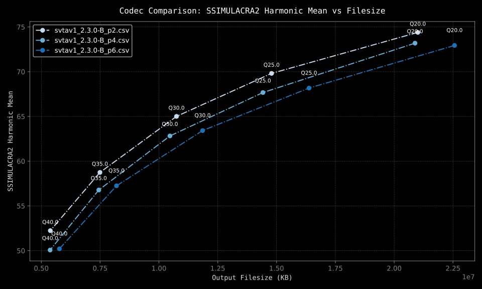
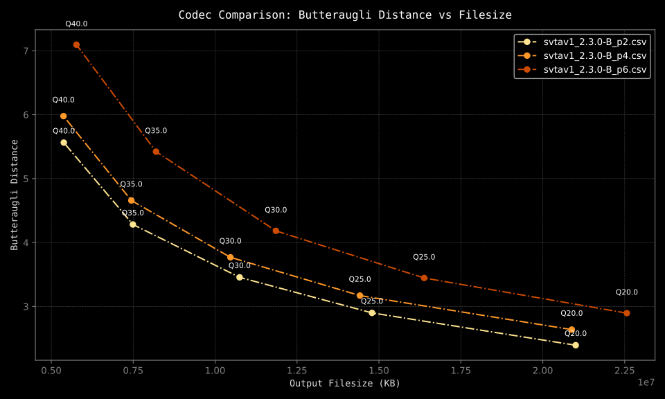
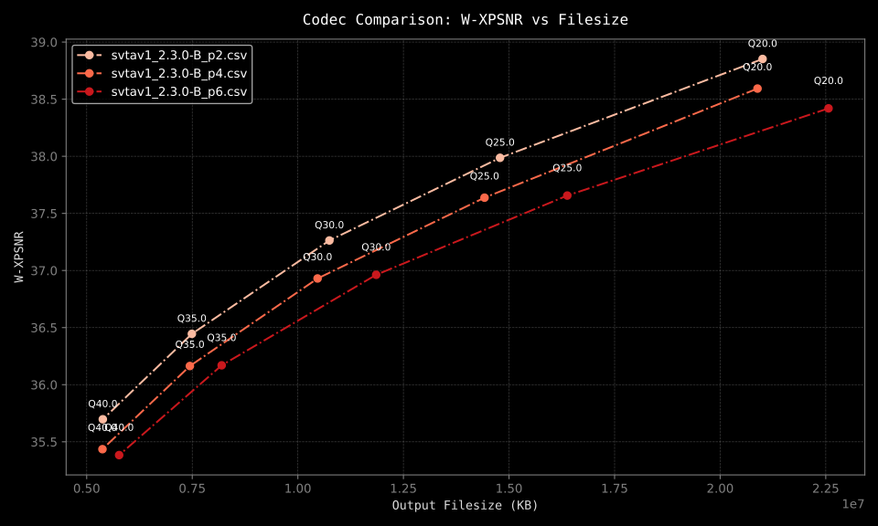

# PSY-EX Metrics

The Psychovisual Experts group presents `metrics`, a video quality assessment
toolkit that provides a suite of scripts for measuring and comparing video
codecs using metrics such as SSIMULACRA2, Butteraugli (3pnorm), and XPSNR. The
project includes modules for processing video files, running video encoding, and
generating both numerical and visual reports from quality metrics.

The four main scripts are:

- `scores.py`: Compute detailed quality scores for a given source/distorted
  video pair.
- `encode.py`: Encode videos using various codecs (e.g., x264, x265, svtav1,
  aomenc) and print metrics.
- `stats.py`: Encode videos at various quality settings and log metric
  statistics to a CSV file.
- `plot.py`: Generate visual plots from CSV metric data for side-by-side codec
  comparison.

Read more below on how to install and use these utilities.

## Sample Graphs







## Overview

PSY-EX Metrics enables you to:

- Encode videos using various codecs (e.g., x264, x265, svtav1, aomenc).
- Calculate visual quality & distance metrics, such as:
  - SSIMULACRA2
  - Butteraugli
  - Weighted XPSNR
- Generate CSV files with computed metric statistics for further analysis.
- Visualize the metrics side-by-side, comparing codec results through
  customizable plots.

## Installation

### Dependencies

- [uv](https://github.com/astral-sh/uv/blob/main/README.md), a Python project
  manager
- FFmpeg >= 7.1 (for XPSNR calculations)
- VapourSynth, and required plugins:
  - ffms2
  - [vszip](https://github.com/dnjulek/vapoursynth-zip)
  - [vship](https://github.com/Line-fr/Vship) [Optional: provides GPU support]

### Install Steps

0. Install required dependencies outlined in the previous section

1. Clone the repository

```bash
git clone https://github.com/psy-ex/metrics.git
cd metrics/
```

2. Enter the scripts directory & mark the scripts as executable

```bash
cd scripts/
chmod a+x stats.py scores.py plot.py encode.py
```

3. Run a script, no Python package installation required

```bash
./scores.py source.mkv distorted.mkv
```

## Usage

### scores.py

```bash
% ./scores.py --help
usage: scores.py [-h] [-e EVERY] [-g GPU_THREADS] [-c CPU_THREADS] source distorted

Run metrics given a source video & a distorted video.

positional arguments:
  source                Source video path
  distorted             Distorted video path

options:
  -h, --help            show this help message and exit
  -e, --every EVERY     Only score every nth frame. Default 1 (every frame)
  -g, --gpu-threads GPU_THREADS
                        Number of GPU threads for SSIMULACRA2 & Butteraugli
  -c, --cpu-threads CPU_THREADS
                        Number of CPU threads for SSIMULACRA2 (overridden by GPU threads)
```

Example:

```bash
./scores.py source.mkv distorted.mkv -e 3
```

This command compares a reference `source.mkv` with `distorted.mkv`, scoring
every 3rd frame.

### encode.py

```bash
% ./encode.py --help
usage: encode.py [-h] -i INPUT -q QUALITY [-b KEEP] [-e EVERY] [-g GPU_THREADS] [-c CPU_THREADS] [-n] {x264,x265,svtav1,aomenc} ...

Generate SSIMULACRA2, Butteraugli, and XPSNR statistics for a single video encode.

positional arguments:
  {x264,x265,svtav1,aomenc}
                        Which video encoder to use
  encoder_args          Additional encoder arguments (pass these after a '--' delimiter)

options:
  -h, --help            show this help message and exit
  -i, --input INPUT     Path to source video file
  -q, --quality QUALITY
                        Desired CRF value for the encoder
  -b, --keep KEEP       Output video file name
  -e, --every EVERY     Only score every nth frame. Default 1 (every frame)
  -g, --gpu-threads GPU_THREADS
                        Number of GPU threads for SSIMULACRA2 & Butteraugli
  -c, --cpu-threads CPU_THREADS
                        Number of CPU threads for SSIMULACRA2 (overridden by GPU threads)
  -n, --no-metrics      Skip metrics calculations
```

Examples:

```bash
./encode.py -i source.mkv --keep video.ivf -q 29 svtav1 -- --preset 2
```

This command encodes `source.mkv` at a CRF of 29 using the SVT-AV1 encoder with
the `--preset 2` argument. It will print metrics after encoding.

```bash
./encode.py -i source.mkv --keep video.ivf -q 29 -g 4 svtav1 -- --preset 8
```

This command does the same as the previous command, but uses 4 GPU threads
instead of the CPU as well as passing a higher preset value to SVT-AV1.

### stats.py

```bash
usage: stats.py [-h] -i INPUTS [INPUTS ...] -q QUALITY -o OUTPUT [-e EVERY] [-g GPU_THREADS] [-c CPU_THREADS] [-k] {x264,x265,svtav1,aomenc} ...

Generate SSIMULACRA2, Butteraugli, and XPSNR statistics for a series of video encodes.

positional arguments:
  {x264,x265,svtav1,aomenc}
                        Which video encoder to use
  encoder_args          Additional encoder arguments (pass these after a '--' delimiter)

options:
  -h, --help            show this help message and exit
  -i, --inputs INPUTS [INPUTS ...]
                        Path(s) to source video file(s)
  -q, --quality QUALITY
                        List of quality values to test (e.g. 20 30 40 50)
  -o, --output OUTPUT   Path to output CSV file
  -e, --every EVERY     Only score every nth frame. Default 1 (every frame)
  -g, --gpu-threads GPU_THREADS
                        Number of GPU threads for SSIMULACRA2 & Butteraugli
  -c, --cpu-threads CPU_THREADS
                        Number of CPU threads for SSIMULACRA2 (overridden by GPU threads)
  -k, --keep            Keep output video files
```

Example:

```bash
./stats.py \
  -i source.mkv \
  -q "20 25 30 35 40" \
  -o ./svtav1_2.3.0-B_p8.csv \
  -e 3 \
  svtav1 -- --preset 8 --tune 2
```

This command processes `source.mkv` at quality levels 20, 25, 30, 35, & 40 using
the SVT-AV1 encoder, scoring every 3rd frame, and writes the results to an
output `svtav1_2.3.0-B_p8.csv`.

You can also script this to run across multiple speed presets:

```bash
#!/bin/bash -eu

for speed in {2..6}; do
  ./stats.py \
  -i ~/Videos/reference/*.y4m \
  -q "20 25 30 35 40" \
  -o ./svtav1_2.3.0-B_p${speed}.csv \
  -e 3 \
  svtav1 -- --preset $speed --tune 2
done
```

This snippet here will run the same command as before, but across all speed
presets from 2 to 6 (naming the output CSV files accordingly). It will also
encode all of the files ending in `.y4m` in the `~/Videos/reference` directory.

### plot.py

```bash
./plot.py --help
usage: plot.py [-h] -i INPUT [INPUT ...] [-f FORMAT]

Plot codec metrics from one or more CSV files (one per codec) for side-by-side comparison.

options:
  -h, --help            show this help message and exit
  -i, --input INPUT [INPUT ...]
                        Path(s) to CSV file(s). Each CSV file should have the same columns.
  -f, --format FORMAT   Save the plot as 'svg', 'png', or 'webp'
```

Example:

```bash
./plot.py -i codec1_results.csv codec2_results.csv -f webp
```

This command reads `codec1_results.csv` and `codec2_results.csv`, generating
separate plots (one for each metric: SSIMULACRA2, Butteraugli, and XPSNR) as
WebP images.

It will also print BD-rate statistics for each metric, comparing the two results
from the CSV files.

`plot.py` also outputs a CSV file containing the average encode time for an
input file accompanied by the corresponding average BD-rate. These statistics
can assist in looking at overall encoder efficiency across multiple speed
presets or configurations.

## License

This project was originally authored by @gianni-rosato & is provided as FOSS
through the Psychovisual Experts Group.

Usage is subject to the terms of the [LICENSE](LICENSE). Please refer to the
linked file for more information.
