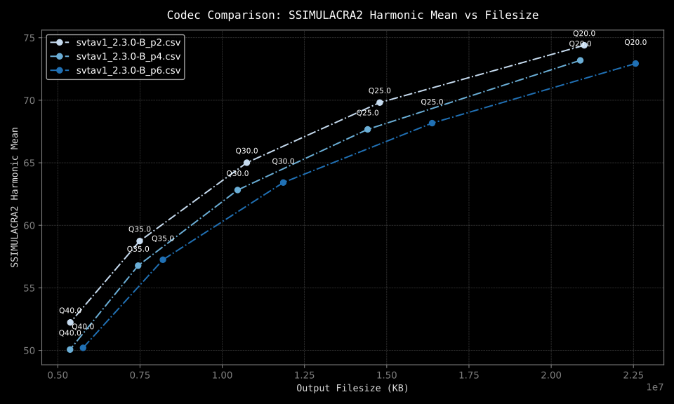
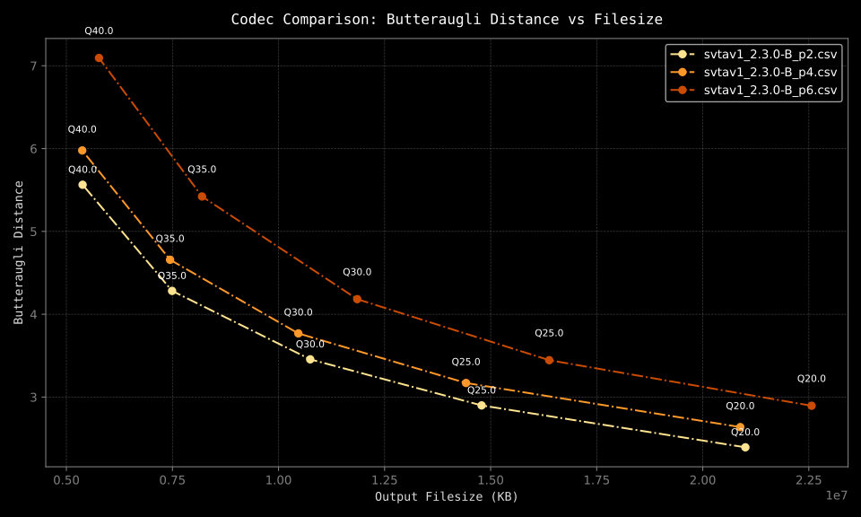
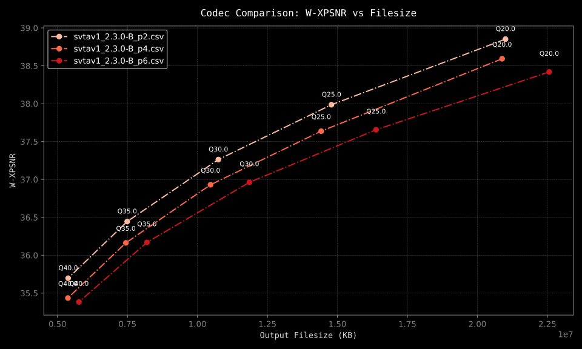

# PSY-EX Metrics

The Psychovisual Experts group presents `metrics`, a video quality assessment
toolkit that provides a suite of scripts for measuring and comparing video
codecs using metrics such as:

- Average SSIMULACRA2 across frames
- Average Butteraugli (3pnorm) across frames
- Average CVVDP across frames
- Weighted XPSNR
- VMAF NEG (Harmonic Mean)
- VMAF
- SSIM
- PSNR

We include modules for processing video files, running video encoding, and
generating both numerical and visual reports from quality metrics.

The four main scripts are:

- `scores.py`: Compute detailed quality scores for a given source/distorted
  video pair.
- `encode.py`: Encode videos using various codecs (e.g., x264, x265, svtav1,
  aomenc, libvpx/VP9) and print metrics.
- `stats.py`: Encode videos at various quality settings and log metric
  statistics to a CSV file.
- `plot.py`: Generate visual plots from CSV metric data for side-by-side codec
  comparison.

Read more below on how to install and use these utilities.

## Sample Graphs







## Overview

PSY-EX Metrics enables you to:

- Encode videos using various codecs (e.g., x264, x265, svtav1, aomenc,
  libvpx/VP9).
- Calculate various metrics.
- Generate CSV files with computed metric statistics for further analysis.
- Visualize the metrics side-by-side, comparing codec results through
  customizable plots.

## Installation

### Dependencies

- [uv](https://github.com/astral-sh/uv/blob/main/README.md), a Python project
  manager
- FFmpeg >= 7.1 (required for XPSNR and video processing)
- [FFVship](https://github.com/Line-fr/FFVship) (Standalone tool for GPU-accelerated metrics)

### Install Steps

1. Clone the repository

```bash
git clone https://github.com/psy-ex/metrics.git
cd metrics/
```

2. Enter the scripts directory & mark the scripts as executable

```bash
cd scripts/
chmod a+x stats.py scores.py plot.py encode.py
```

3. Run a script, no Python package installation required

```bash
./scores.py source.mkv distorted.mkv
```

## Usage

### scores.py

```bash
% ./scores.py --help
usage: scores.py [-h] [-e EVERY] [-g GPU_STREAMS] [-t THREADS] source distorted

Run metrics given a source video & a distorted video.

positional arguments:
  source                Source video path
  distorted             Distorted video path

options:
  -h, --help            show this help message and exit
  -e, --every EVERY     Only score every nth frame. Default 1 (every frame)
  -g, --gpu-streams GPU_STREAMS
                        Number of GPU threads for FFVship (SSIMULACRA2/Butteraugli/CVVDP)
  -t, --threads THREADS
                        Number of decoder threads for FFVship. Default 2
```

Example:

```bash
./scores.py source.mkv distorted.mkv -e 3 -g 8 -t 4
```

This command compares a reference `source.mkv` with `distorted.mkv`, scoring
every 3rd frame using 8 GPU threads and 4 decoder threads via FFVship.

### encode.py

```bash
% ./encode.py --help
usage: encode.py [-h] -i INPUT -q QUALITY [-b KEEP] [-e EVERY] [-g GPU_STREAMS] [-t THREADS] [-n] {x264,x265,svtav1,aomenc,vpxenc} ...

Generate statistics for a single video encode.

positional arguments:
  {x264,x265,svtav1,aomenc,vpxenc}
                        Which video encoder to use
  encoder_args          Additional encoder arguments (pass these after a '--' delimiter)

options:
  -h, --help            show this help message and exit
  -i, --input INPUT     Path to source video file
  -q, --quality QUALITY
                        Desired CRF value for the encoder
  -b, --keep KEEP       Output video file name
  -e, --every EVERY     Only score every nth frame. Default 1 (every frame)
  -g, --gpu-streams GPU_STREAMS
                        Number of GPU threads for FFVship (SSIMULACRA2/Butteraugli/CVVDP)
  -t, --threads THREADS
                        Number of decoder threads for FFVship. Default 2
  -n, --no-metrics      Skip metrics calculations
```

### stats.py

```bash
usage: stats.py [-h] -i INPUTS [INPUTS ...] -q QUALITY -o OUTPUT [-e EVERY] [-g GPU_STREAMS] [-t THREADS] [-k] {x264,x265,svtav1,aomenc,vpxenc} ...

Generate statistics for a series of video encodes.

positional arguments:
  {x264,x265,svtav1,aomenc,vpxenc}
                        Which video encoder to use
  encoder_args          Additional encoder arguments (pass these after a '--' delimiter)

options:
  -h, --help            show this help message and exit
  -i, --inputs INPUTS [INPUTS ...]
                        Path(s) to source video file(s)
  -q, --quality QUALITY
                        List of quality values to test (e.g. 20 30 40 50)
  -o, --output OUTPUT   Path to output CSV file
  -e, --every EVERY     Only score every nth frame. Default 1 (every frame)
  -g, --gpu-streams GPU_STREAMS
                        Number of GPU threads for FFVship (SSIMULACRA2/Butteraugli/CVVDP)
  -t, --threads THREADS
                        Number of decoder threads for FFVship. Default 2
  -k, --keep            Keep output video files
```

### plot.py

```bash
./plot.py --help
usage: plot.py [-h] -i INPUT [INPUT ...] [-f FORMAT]

Plot codec metrics from one or more CSV files (one per codec) for side-by-side comparison.

options:
  -h, --help            show this help message and exit
  -i, --input INPUT [INPUT ...]
                        Path(s) to CSV file(s). Each CSV file should have the same columns.
  -f, --format FORMAT   Save the plot as 'svg', 'png', or 'webp'
```

## License

This project was originally authored by @gianni-rosato & is provided as FOSS
through the Psychovisual Experts Group.

Usage is subject to the terms of the [LICENSE](LICENSE). Please refer to the
linked file for more information.
